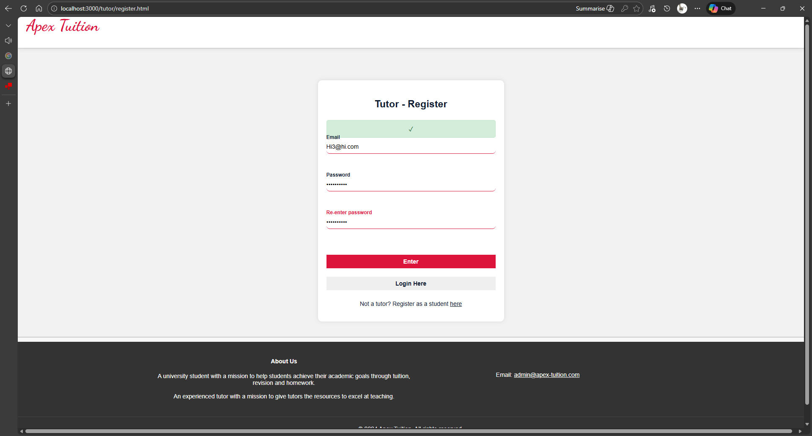
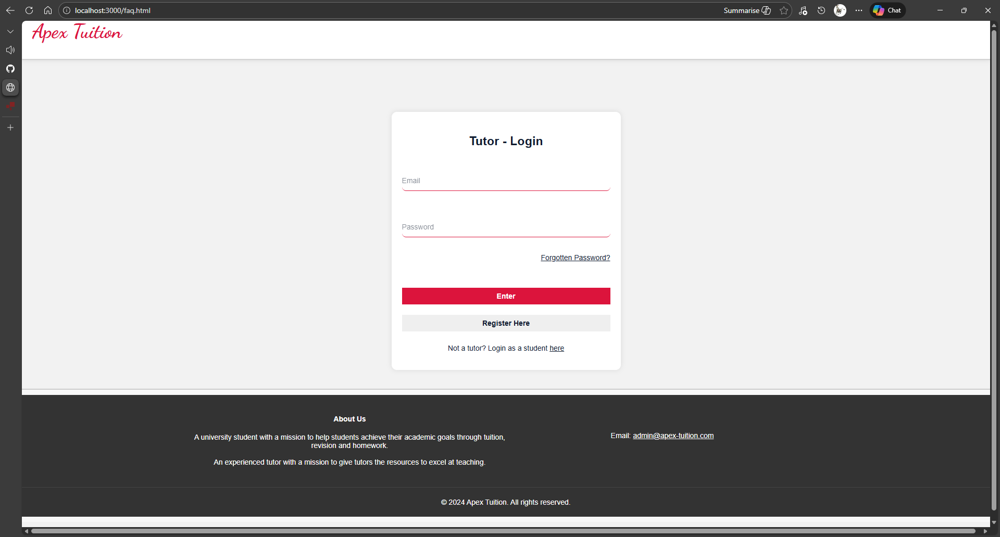

# Apex Tuition — Full‑Stack Tutoring Platform

A full‑stack tutoring website being designed for students and tutors.  
Built to streamline lesson booking, homework generation, communication, and account management.    
This showcases some of the key parts of the website. For access to the full codebase, please contact me directly!

---

## Project Overview

Apex Tuition is being developed as a large‑scale personal project to deepen my understanding of full‑stack web development and explore how automation can improve the education industry.  
Over **400 hours** were spent designing, coding, testing, and refining the platform.

---

## Key Features

### Multi‑Role System
- **Students**: book lessons, view homework, message tutors  
- **Tutors**: manage schedules, upload resources and homework, track student progress

### Authentication & Security
- Encrypted passwords  
- Email verification  
- Secure session handling  
- Protected routes for different user types  

### AI‑Powered Homework Generation
- Integrated external APIs to automatically generate homework questions  
- Reduced admin workload by **70%**  
- Customisable topic selection and number of questions  

### Automated Email System
- Account verification  
- Lesson reminders  
- Complaint handling  
- Custom domain email integration  

### Database Architecture (MongoDB)
- Multiple collections for:
  - Users  
  - Lessons  
  - Homework  
  - Messages  
  - Complaints  
- Designed for scalability and fast querying  

### Clean, Responsive UI
- Built with HTML, CSS, and JavaScript    
- Also inspired by UX research from leading tutoring platforms  

---

## Architecture Overview

- **Backend**: Node.js + Express  
- **Database**: MongoDB  
- **Frontend**: HTML, CSS, JavaScript  
- **Email**: Custom domain + backend integration  
- **AI**: External APIs for homework generation
- **API**: APIs used for location lookup for addresses, payment systems, zoom lesson booking, AI.

---

## Screenshots  

### Home page

### Tutor Registration

### Tutor Registration Successful

### Tutor Login

More images coming soon...

---

## Project Summary

Apex Tuition represents my largest and most ambitious project to date.  
It strengthened my skills in:

- Full‑stack development  
- API integration  
- Database design  
- Authentication and security  
- UI/UX design  
- Automation and AI integration  

---

